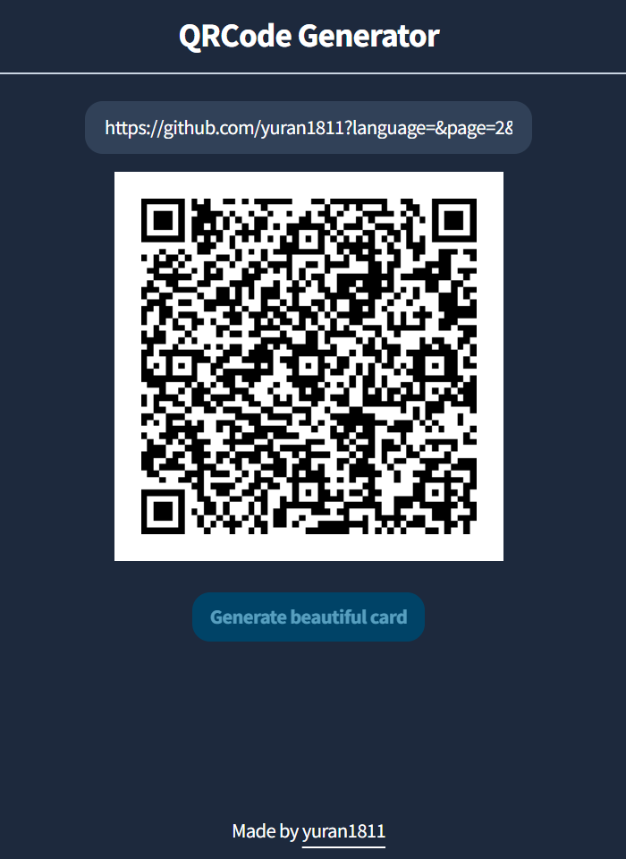

<h1 align="center">QRCode Generator</h1>
<p align="center" style="font-size:16px"><strong>QRCode Generator Simple Demo</strong></p>
<p align="center">  
  
</p>

<p align="center">
  
  
  
  
  
</p>

<div align="center"><a href="https://yuran1811.github.io/qrcode-generator/" target="_blank">Live Demo</a></div>

## Features

## Tech Stack


## Screenshots

<div style="display:flex;gap:12px;justify-content:center">
	
	
</div>

## Quick Start

Follow these steps to set up the project locally on your machine.

**Prerequisites**

Make sure you have the following installed or downloaded on your machine:

- [Git](https://git-scm.com/)
- [Node.js](https://nodejs.org/en)

**Cloning the Repository**

```bash
git clone https://github.com/yuran1811/qrcode-generator.git
cd qrcode-generator
```

**Installation**

- Enable `pnpm` to build and run the project

```bash
corepack enable pnpm
```

Install the project dependencies:

```bash
pnpm install
```

**Running the Project**

```bash
pnpm dev
```

Open [http://localhost:5173](http://localhost:5173) in your browser to view the project.

## References

- This project uses [qrcodejs](https://davidshimjs.github.io/qrcodejs/) to generate the qrcode.
  - The qrcode which created by qrcodejs is unique
  - Read the [qrcodejs document](./src/libs/qrcodejs/README.md)
